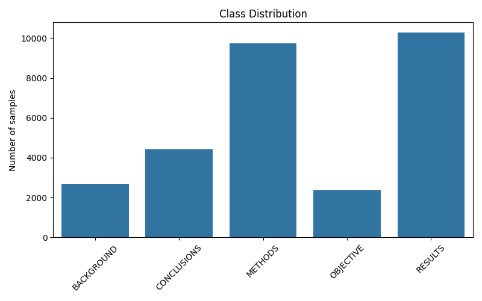
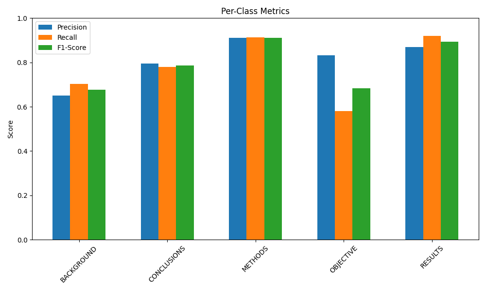
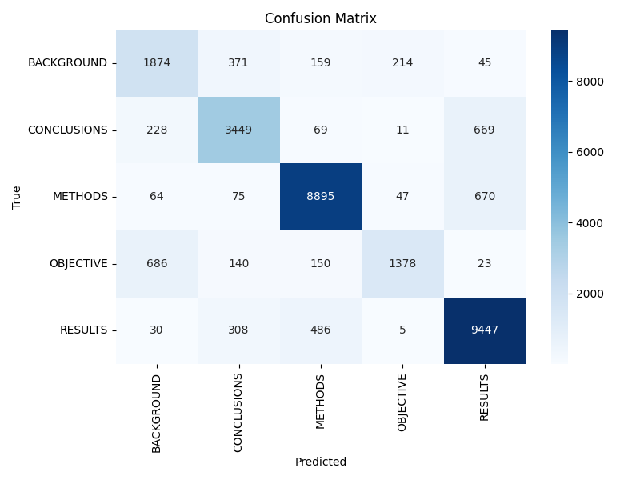
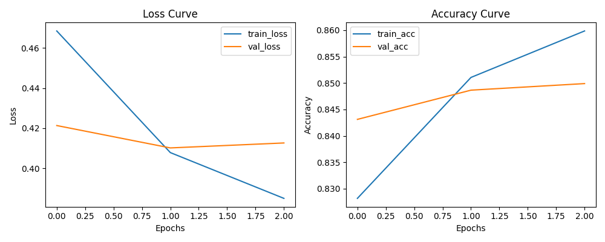
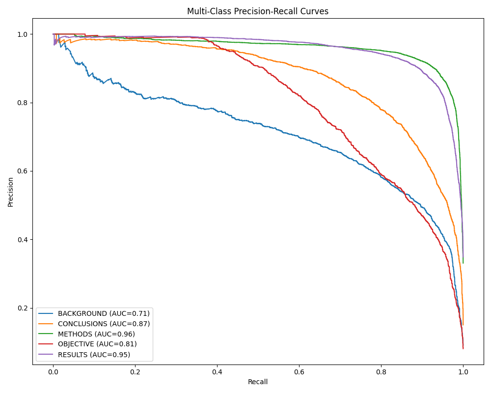

# PubMed RCT Classifier

A state-of-the-art Transformer-based model achieving **84.9% Accuracy** on the PubMed 200k RCT dataset. This project implements a Deep Learning pipeline to automatically categorize sentences in medical abstracts into: `BACKGROUND`, `OBJECTIVE`, `METHODS`, `RESULTS`, or `CONCLUSIONS`.

---

## Model Performance

Our model achieves robust performance on the PubMed RCT test set:

| Metric | Score |
| :--- | :--- |
| **Accuracy** | **84.9%** |
| **Weighted F1-Score** | **0.85** |

### 1. Data Context: The Imbalance Challenge

The dataset follows the natural distribution of medical abstracts, leading to class imbalance.

- **Dominant Classes**: `RESULTS` and `METHODS` (~68% of data).
- **Minority Classes**: `OBJECTIVE` and `BACKGROUND`.



### 2. Performance by Class

The model excels at identifying experimental methods and results but faces challenges with abstract introductions.

| Class | F1-Score | Precision | Recall | Observation |
| :--- | :--- | :--- | :--- | :--- |
| **METHODS** | **0.91** | 0.91 | 0.91 | **Strongest.** Very distinct linguistic patterns. |
| **RESULTS** | **0.89** | 0.87 | 0.92 | **High Recall.** The model rarely misses a result. |
| **CONCLUSIONS** | **0.79** | 0.79 | 0.78 | Solid, but sometimes blends with Results. |
| **OBJECTIVE** | **0.68** | **0.83** | **0.58** | **Under-performing.** High precision but low recall. |
| **BACKGROUND** | **0.68** | 0.65 | 0.70 | **Weakest overall.** Most confused class. |



### 3. Confusion Analysis

The confusion matrix reveals the model's decision boundaries:

- **Background-Objective Trap**: 757 actual Objectives were misclassified as Background. This explains the low recall for `OBJECTIVE`.
- **Results vs. Conclusions**: 227 Conclusions were labeled as Results, a common ambiguity in scientific writing.



### 4. Training Dynamics

Training showed stable convergence with a healthy gap between training and validation loss, indicating no severe overfitting.



### 5. Precision-Recall Curves

The PR curves confirm near-perfect performance for `METHODS` and `RESULTS`. For `OBJECTIVE` and `BACKGROUND`, precision drops sharply as recall increases.



---

## Quick Start

### Installation

```bash
pip install -r requirements.txt
```

### Usage

**Training**:

```bash
python script/train.py --config config.yaml
```

**Evaluation**:

```bash
python script/evaluate.py --data.data_dir pubmed_rct
```

### Notebook Demo

Run `notebook/PubMed_RCT_Demo.ipynb` for an interactive walkthrough.

---

## Project Structure

```
├── classifier_core/    # Model, data loading, and evaluation logic
├── notebook/           # Interactive demo
├── script/             # Training and evaluation scripts
├── assets/             # Evaluation plots
└── README.md           # Project documentation
```

---

### Author

<div>
  <table align="center">
    <tr>
      <td align="center">
        <a href="https://github.com/YassienTawfikk" target="_blank">
          <br/>
          <sub><b>Yassien Tawfik</b></sub>
        </a>
      </td>
    </tr>
  </table>
</div>

---
